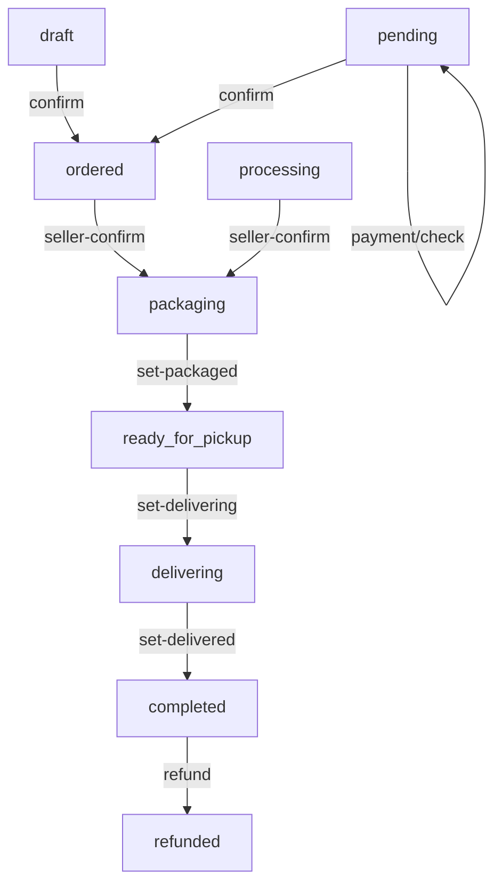
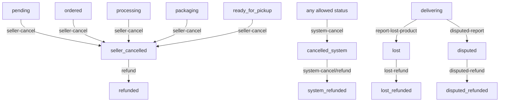
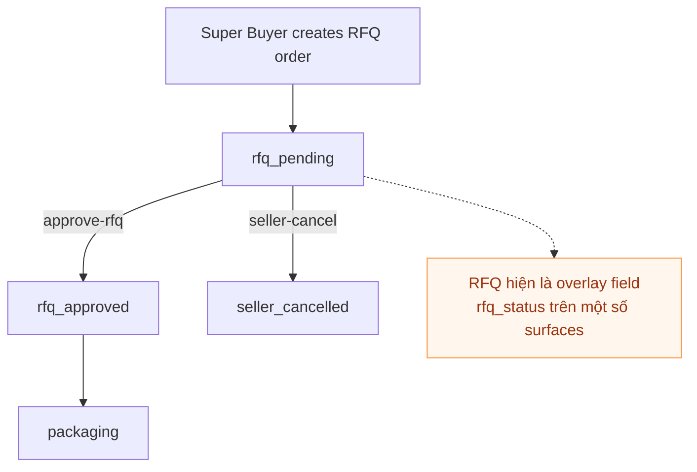

# ORDER_STATUSES

## Purpose

Tài liệu này gom toàn bộ current order statuses, actions, transitions, filters, và RFQ overlay đang được implement rải rác trong hệ thống.

Mục tiêu:
- Review lại trạng thái hiện có trước khi chỉnh sửa
- Xác định một bộ canonical flow chung cho desktop, webapp, Super Buyer, admin, và mobile app
- Chỉ ra chỗ nào current implementation đang lệch hoặc thiếu

## Scope

Đã đối chiếu các bề mặt sau:
- Desktop seller: `/store/orders`
- Seller webapp mobile: `/brand/mobile/orders`
- Super Buyer: `/brand/super-buyer/mobile/orders`
- Mobile app: order screens
- Admin order management liên quan cùng flow
- Backend sources of truth và API transition logic

## Current Source Files

### Canonical-ish config đang có
- `app/config/order_statuses.php`
- `app/config/order_status_description.php`
- `app/app/Wordpress/Order.php`
- `app/app/DTOs/OrderDTO.php`

### UI surfaces hiện tại
- `app/resources/views/store/orders/index.blade.php`
- `app/resources/views/store/orders/list.blade.php`
- `app/resources/views/webapp/orders/index.blade.php`
- `app/resources/views/webapp/orders/_actions.blade.php`
- `app/resources/views/webapp/orders/_progress.blade.php`
- `app/resources/views/webapp/orders/_status_banner.blade.php`
- `app/resources/views/superbuyer/orders/index.blade.php`
- `app/resources/views/superbuyer/orders/_list.blade.php`
- `app/resources/views/superbuyer/orders/show.blade.php`
- `app/resources/views/admin/brand/orders/index.blade.php`
- `app/resources/views/admin/brand/orders/list.blade.php`
- `mobile/src/screens/orders/OrdersScreen.tsx`
- `mobile/src/screens/orders/OrderDetailScreen.tsx`
- `mobile/src/components/StatusBadge.tsx`
- `mobile/src/types/index.ts`

## Current Normalization Rules

### Status key shape
- Backend canonical config đang dùng raw key dạng `ordered`, `packaging`, `ready_for_pickup`
- Một số views và mobile app đang dùng WooCommerce style key có prefix `wc-`
- Một số nơi dùng hyphen thay vì underscore, ví dụ `wc-ready-for-pickup`
- Một số nơi dùng status riêng cho RFQ là `rfq_pending` nhưng bản chất là overlay lên order flow chính

### Review decision tạm chốt
- Canonical business key nên dùng raw key không prefix trong backend config
- `wc-*` chỉ nên là transport key hoặc key từ WP boundary, cần normalize một chỗ duy nhất
- RFQ nên được xem là overlay flow, không phải thay thế toàn bộ order lifecycle

## Business-Safe Interpretation

Phần này giữ nguyên toàn bộ status key hiện tại để không ảnh hưởng code, chỉ chốt lại cách hiểu business cho nhất quán.

### Nguyên tắc chốt
- Không đổi tên status key hiện tại
- Không gộp/xóa status trong code ở giai đoạn này
- Chỉ thống nhất cách hiểu business, cách hiển thị, và action hợp lệ
- Nếu nhiều status đang trùng vai trò, chấp nhận coi một số status là alias hoặc support status thay vì main business step

### Nhóm business nên hiểu như sau

#### 1. Main lifecycle statuses
- `draft`: đơn mới tạo, chưa chốt
- `pending`: chờ thanh toán hoặc chờ xác minh thanh toán
- `ordered`: đơn đã được tạo thành công, chờ seller xử lý
- `processing`: giữ nguyên key hiện tại, nhưng hiểu business là cùng pha với `ordered`; đây là support status, không phải step mới tách biệt
- `packaging`: seller đã nhận xử lý, đang chuẩn bị hàng
- `ready_for_pickup`: đã đóng gói xong, chờ bàn giao cho vận chuyển
- `delivering`: đơn đang giao
- `completed`: đơn giao xong và xem như hoàn tất business flow chính

#### 2. Cancellation statuses
- `seller_cancelled`: seller chủ động hủy đơn
- `cancelled_system`: admin hoặc hệ thống hủy đơn
- `cancelled`: trạng thái hủy chung hoặc legacy umbrella status

Decision business-safe:
- UI có thể hiển thị cả 3 là `Đã hủy`
- Lý do hủy nên giải thích bằng context hoặc metadata, không bắt user cuối phải phân biệt quá sâu

#### 3. Refund / resolution statuses
- `refunded`: hoàn tiền chung
- `lost_refunded`: case mất hàng đã hoàn tiền
- `disputed_refunded`: case tranh chấp đã hoàn tiền
- `system_refunded`: case hệ thống hủy và đã hoàn tiền

Decision business-safe:
- Tất cả đều là trạng thái kết thúc sau hoàn tiền
- UI có thể hiển thị chung là `Đã hoàn tiền`, còn admin/report có thể tách chi tiết theo key hiện tại

#### 4. Incident statuses
- `lost`: hàng thất lạc trong quá trình giao
- `disputed`: phát sinh tranh chấp giao nhận

Decision business-safe:
- Đây là exception statuses, không phải happy-path step của lifecycle chính
- Nên xem là nhánh sự cố tách từ `delivering`

#### 5. Payment / platform support statuses
- `failed`: thanh toán thất bại hoặc checkout thất bại
- `on-hold`: đang bị giữ để chờ xác minh hoặc xử lý thêm
- `checkout-draft`: draft được tạo từ checkout flow nhưng chưa hoàn tất

Decision business-safe:
- Đây là support statuses cho payment/platform flow
- Không nên coi là trạng thái vận hành đơn hàng chính như `packaging` hay `delivering`

#### 6. RFQ overlay statuses
- `rfq_pending`: chờ seller phản hồi RFQ
- `rfq_approved`: RFQ đã duyệt, hiện là overlay field chứ không phải order status chính

Decision business-safe:
- RFQ vẫn là overlay trên order flow hiện tại
- Không thay RFQ thành main order lifecycle ở giai đoạn này

### Cách hiểu để các status hiện tại “make sense” mà không đổi code

#### `ordered` và `processing`
- Giữ nguyên cả hai vì code đang dùng
- Business hiểu là cùng một pha `seller chưa giao vận chuyển`
- Khi hiển thị user-facing, có thể dùng cùng một label nhóm như `Đã đặt hàng` hoặc `Đang xử lý`

#### `draft` và `checkout-draft`
- Giữ nguyên cả hai vì hiện có ở filter và badge
- Business hiểu `checkout-draft` là một biến thể kỹ thuật của `draft` phát sinh từ checkout
- User-facing có thể coi cùng nhóm `Nháp / chưa hoàn tất`

#### `cancelled`, `seller_cancelled`, `cancelled_system`
- Không sửa key
- Business hiểu cùng là `đơn đã hủy`
- Khác nhau ở tác nhân gây hủy, không khác nhau ở outcome cuối cho buyer

#### `refunded`, `lost_refunded`, `disputed_refunded`, `system_refunded`
- Không sửa key
- Business hiểu cùng là `đã hoàn tiền`
- Khác nhau ở nguyên nhân kết thúc

### Action guardrails nên dùng khi review UI/UX
- `seller-cancel` chỉ nên xem là hợp lý từ `pending`, `ordered`, `processing`, `packaging`
- `ready_for_pickup` trở đi không nên coi là cancel flow bình thường; nếu vẫn có action thì phải xem là manual/admin exception
- `disputed-report` hợp lý hơn khi phát sinh gần cuối giao hàng; nếu đang ở `delivering` thì hiểu là phát hiện sự cố giao nhận
- `payment/check` là side-effect action, không nên coi là transition business step độc lập
- `complete`, `deliver`, `pay` là legacy hoặc route-level action; khi tài liệu hóa business nên ưu tiên map về các transition chính đã có trong bảng

### Super Buyer source of truth
- Super Buyer phải lấy chung từ `app/app/Support/OrderStatusCatalog.php` cho 4 thứ: display status, buyer-facing description, filters, và actions
- RFQ overlay không còn override vô điều kiện:
  - `rfq_pending` là display status khi buyer còn đang chờ seller phản hồi
  - `rfq_approved` chỉ nên hiện ở giai đoạn trước bàn giao vận chuyển (`ordered`, `processing`, `packaging`)
  - từ `ready_for_pickup` trở đi, display status quay về base lifecycle status
- Buyer cancel policy hợp lý cho app thương mại:
  - cho phép: `pending`, `ordered`, `processing`, `packaging`, `rfq_pending`
  - không cho phép: `ready_for_pickup`, `delivering`, `completed`, các trạng thái đã hủy, hoàn tiền, hoặc sự cố
- Buyer-facing action copy nên đổi theo ngữ cảnh:
  - `rfq_pending`: “Hủy yêu cầu báo giá”
  - `pending`: mô tả đơn còn ở giai đoạn chờ thanh toán/xác nhận thanh toán
  - `ordered` / `processing`: mô tả shop chưa bàn giao đơn vị vận chuyển
  - `packaging` / `rfq_approved`: mô tả vẫn còn hủy được nhưng chỉ trước lúc bàn giao đơn vị vận chuyển

### Display grouping recommendation

Để các surface khác nhau bớt lệch nhau mà không cần đổi code, có thể nhóm hiển thị như sau:

| Display group | Current keys |
|---|---|
| `Nháp / chưa hoàn tất` | `draft`, `checkout-draft` |
| `Chờ thanh toán / chờ xác minh` | `pending`, `on-hold` |
| `Đã đặt / đang xử lý` | `ordered`, `processing` |
| `Đang đóng gói` | `packaging` |
| `Sẵn sàng giao` | `ready_for_pickup` |
| `Đang giao` | `delivering` |
| `Hoàn thành` | `completed` |
| `Đã hủy` | `cancelled`, `seller_cancelled`, `cancelled_system` |
| `Đã hoàn tiền` | `refunded`, `lost_refunded`, `disputed_refunded`, `system_refunded` |
| `Sự cố` | `lost`, `disputed` |
| `RFQ` | `rfq_pending`, `rfq_approved` |

## STATUSES

| Status key | Title | Description hiện tại | Actions list |
|---|---|---|---|
| `draft` | Nháp | Đơn hàng đang ở trạng thái nháp, chưa chính thức xác nhận. | `confirm` |
| `pending` | Chờ thanh toán | Đơn hàng đã được tạo và đang chờ xác nhận thanh toán từ cổng thanh toán. | `payment/check`, `confirm`, `seller-cancel` |
| `ordered` | Đã đặt hàng | Khách đã đặt hàng thành công, chờ người bán xác nhận. | `seller-confirm`, `seller-cancel` |
| `processing` | Đã đặt hàng | Đơn hàng đang được người bán kiểm tra và chuẩn bị xử lý. Current config đang trùng vai trò với `ordered`. | `seller-confirm`, `seller-cancel` |
| `packaging` | Đã xác nhận đơn | Người bán đã xác nhận đơn hàng và chuẩn bị giao cho đơn vị vận chuyển. | `set-packaged`, `seller-cancel` |
| `ready_for_pickup` | Sẵn sàng giao hàng | Đơn hàng đã đóng gói xong và sẵn sàng bàn giao cho đơn vị vận chuyển. | `set-delivering`, `seller-cancel` |
| `delivering` | Đang giao hàng | Đơn hàng đang trong quá trình vận chuyển đến khách hàng. | `set-delivered`, `report-lost-product`, `disputed-report` |
| `completed` | Hoàn thành | Đơn hàng đã được giao thành công và khách hàng đã nhận hàng. | `refund` |
| `seller_cancelled` | Người bán đã hủy | Người bán đã hủy đơn hàng, cần hoàn tiền nếu đã thanh toán. | `refund` |
| `cancelled_system` | Hệ thống đã hủy | Đơn hàng bị hủy bởi admin hoặc hệ thống. | `system-cancel/refund` |
| `lost` | Mất hàng | Đơn hàng bị thất lạc trong quá trình giao hàng. | `lost-refund` |
| `disputed` | Tranh chấp | Khách phản hồi chưa nhận được hàng dù hệ thống ghi nhận đã giao. | `disputed-refund` |
| `cancelled` | Đã hủy | Trạng thái hủy chung. Hiện tại chưa rõ có nên giữ như status riêng user-facing hay chỉ là alias. | none |
| `refunded` | Đã hoàn tiền | Đơn hàng đã được hoàn tiền đầy đủ. | none |
| `lost_refunded` | Đã hoàn tiền (mất hàng) | Đơn bị mất và đã hoàn tiền cho khách. | none |
| `disputed_refunded` | Đã hoàn tiền (tranh chấp) | Đơn bị tranh chấp và đã hoàn tiền cho khách sau xác minh. | none |
| `system_refunded` | Đã hoàn tiền (hệ thống) | Đơn bị hủy bởi admin và đã hoàn tiền cho khách. | none |
| `failed` | Thất bại | Thanh toán thất bại hoặc đơn không thể xử lý do lỗi hệ thống. | none |
| `on-hold` | Tạm giữ | Đơn đang tạm giữ để chờ xác minh hoặc xử lý nội bộ. | none |
| `checkout-draft` | Đơn nháp checkout | Đơn được tạo trong quá trình checkout nhưng chưa hoàn tất thanh toán. | none |
| `rfq_pending` | Chờ duyệt RFQ | Người mua đề xuất giá thấp hơn, chờ seller duyệt. | `approve-rfq`, `seller-cancel` |
| `rfq_approved` | RFQ đã duyệt | Không nằm trong `order_statuses.php`, hiện xuất hiện như overlay field ở `super_buyer_orders.rfq_status`. | overlay only |

## ACTIONS

| Action | From status | To status | Mô tả action |
|---|---|---|---|
| `confirm` | `draft`, `pending` | `ordered` | Xác nhận đơn từ nháp hoặc sau khi cần chốt ở trạng thái chờ thanh toán. |
| `payment/check` | `pending` | `pending` hoặc next state sau verify | Kiểm tra lại thanh toán từ BaoKim. Hiện là action side-effect, không phải transition cố định. |
| `seller-confirm` | `ordered`, `processing` | `packaging` | Seller xác nhận đơn và bắt đầu xử lý. |
| `set-packaged` | `packaging` | `ready_for_pickup` | Hoàn tất đóng gói. |
| `set-delivering` | `ready_for_pickup` | `delivering` | Đơn vị vận chuyển đã lấy hàng. |
| `set-delivered` | `delivering` | `completed` | Xác nhận giao thành công. |
| `complete` | varies | `completed` | Action hoàn tất thủ công hoặc legacy path. Cần rà lại use case thật. |
| `deliver` | varies | unclear | Có route/method riêng ở webapp nhưng semantics đang trùng hoặc mơ hồ so với `set-delivering` và `set-delivered`. |
| `pay` | varies | unclear | Có route/method riêng ở webapp nhưng semantics hiện chưa rõ và cần review implement thật. |
| `seller-cancel` | `pending`, `ordered`, `processing`, `packaging`, có thể cả `rfq_pending` | `seller_cancelled` | Seller hủy đơn. Với Super Buyer surface, đây cũng là action cancel duy nhất buyer được dùng trước khi order đi vào giao vận. |
| `refund` | `completed`, `seller_cancelled` | `refunded` | Hoàn tiền chung. |
| `report-lost-product` | `delivering` | `lost` | Báo mất hàng trong lúc giao. |
| `lost-refund` | `lost` | `lost_refunded` | Hoàn tiền cho case mất hàng. |
| `disputed-report` | `delivering` | `disputed` | Báo tranh chấp khi khách nói chưa nhận được hàng. |
| `disputed-refund` | `disputed` | `disputed_refunded` | Hoàn tiền sau tranh chấp. |
| `system-cancel` | varies | `cancelled_system` | Admin hoặc hệ thống hủy đơn. |
| `system-cancel/refund` | `cancelled_system` | `system_refunded` | Hoàn tiền sau khi hệ thống hủy. |
| `approve-rfq` | `rfq_pending` overlay + base order | `rfq_approved` overlay + base `packaging` | Seller chấp nhận RFQ; current implementation cập nhật `rfq_status = rfq_approved` và `status = packaging`. |

## Current Flow Review

### Base lifecycle currently intended

### Cancellation and exception branches

### RFQ overlay flow

## Surface Audit

### Desktop seller `/store/orders`
- Là baseline chính vì có flow phong phú nhất
- Nhưng current implementation còn bug và inconsistency:
  - tabs đang là hardcoded subset, không phản ánh full matrix
  - `rfq_pending` đang là magic string chen giữa constants
  - một số terminal statuses không có tab hoặc filter tương ứng
  - action mapping trong list view có chỗ sai hoặc lệch tên method
  - prefix handling giữa `status` filter và list query chưa thống nhất

### Seller webapp `/brand/mobile/orders`
- Có full mobile-first tabs, banner, progress, detail actions
- Nhưng filters đang hardcode riêng một bộ `wc-*`
- Có route/action nhiều hơn config nhìn thấy, nghĩa là current source of truth chưa thực sự được dùng một chỗ
- Progress chỉ cover main flow, các status đặc biệt đang xử lý bằng exclude logic rời rạc

### Super Buyer orders
- Hiện đang dùng dual state:
  - base `status`
  - overlay `rfq_status`
- Filter subset quá hẹp, không phản ánh lifecycle chung
- Canonical direction sau khi chỉnh:
  - list/detail/filter/action đều đi qua `OrderStatusCatalog`
  - filter có thể đọc cả `status` và `rfq_status`
  - buyer chỉ thấy action buyer thật sự được phép làm trên surface này, thay vì dùng nguyên seller/admin action matrix

### Mobile app
- Có type và badge map riêng
- Chỉ expose 8 filter chips, khác desktop và webapp
- Đang dùng `wc-*` keys trực tiếp trong types và filters
- Nếu backend đổi canonical matrix mà không normalize tốt, mobile sẽ drift tiếp

### Admin
- Có logic hardcode riêng cho filters hoặc status groups
- Không nên bỏ qua vì nếu seller và admin lệch thì cùng một order sẽ hiển thị khác nhau

## Main Inconsistencies To Fix Later

1. Prefix inconsistency
- Có nơi dùng raw key, có nơi dùng `wc-*`, có nơi phải prepend trong controller, có nơi hardcode ở view

2. Legacy or duplicate statuses
- `processing` đang trùng vai trò với `ordered`
- `cancelled` là status hủy chung nhưng song song với `seller_cancelled` và `cancelled_system`
- `checkout-draft` và `draft` cần tách rõ nghĩa hoặc collapse cho UI

3. Action matrix không chạy đồng nhất
- Có action hiện trong config nhưng route map hoặc method wiring chưa đồng bộ ở mọi surface
- Có action tồn tại ở route/controller nhưng semantics chưa rõ như `deliver`, `complete`, `pay`

4. Filter subsets khác nhau
- Desktop, webapp, super buyer, mobile app mỗi nơi đang có bộ tabs khác nhau
- Một số khác biệt là hợp lý theo UX, nhưng hiện tại chưa được quyết định chính thức nên dễ drift

5. RFQ chưa được model rõ
- `rfq_pending` xuất hiện như status thực ở một số nơi
- `rfq_approved` lại là overlay field ở Super Buyer order table
- Cần chốt rõ RFQ là overlay flow trên base lifecycle hay là first-class status family

## Proposed Canonical Direction

### Backend canonical key
- Giữ canonical business keys không prefix trong backend config:
  - `draft`, `pending`, `ordered`, `packaging`, `ready_for_pickup`, `delivering`, `completed`, `seller_cancelled`, `cancelled_system`, `lost`, `disputed`, `refunded`, `lost_refunded`, `disputed_refunded`, `system_refunded`, `rfq_pending`

### Legacy or compatibility alias candidates
- `processing`
- `cancelled`
- `failed`
- `on-hold`
- `checkout-draft`

### UI-facing recommended primary filters

#### Desktop seller and admin
- All
- Draft
- Pending
- Ordered
- RFQ Pending
- Packaging
- Ready for Pickup
- Delivering
- Completed
- Cancelled Group
- Refunded Group
- Lost
- Disputed

#### Seller webapp mobile
- All
- RFQ Pending
- Ordered
- Packaging
- Delivering
- Completed
- Cancelled Group
- Refunded Group

#### Super Buyer
- All
- RFQ Pending
- Ordered
- Packaging
- Delivering
- Completed
- Cancelled Group

#### Mobile app
- All
- RFQ Pending
- Ordered
- Packaging
- Delivering
- Completed
- Cancelled Group
- Refunded Group

### Group filters suggested
- `Cancelled Group` = `seller_cancelled`, `cancelled_system`, optional `cancelled`
- `Refunded Group` = `refunded`, `lost_refunded`, `disputed_refunded`, `system_refunded`

## Review Decisions Needed Before Full Fix

1. `processing` có giữ là visible status không, hay alias về `ordered`
2. `cancelled` có giữ là status thật cho UI không, hay chỉ là alias generic
3. `deliver`, `complete`, `pay` có còn cần trong flow hiện tại không
4. RFQ có được model chính thức là overlay flow không
5. Các terminal refund variants có cần filter riêng trên mọi bề mặt không, hay gộp theo group filter

## Implementation Target After This Review

Sau khi chốt tài liệu này, bước implement nên đi theo thứ tự:
1. Backend normalization và action wiring
2. Desktop `/store/orders`
3. Seller webapp `/brand/mobile/orders`
4. Super Buyer orders
5. Admin orders
6. Mobile app types and screens

## Notes

- Tài liệu này phản ánh current implementation đã đọc trong code, không phải design lý tưởng thuần túy.
- Một số action hoặc transition hiện được định nghĩa nhưng có thể chưa chạy đúng ở runtime. Các điểm đó sẽ được fix ở phase implementation sau khi chốt canonical flow.
